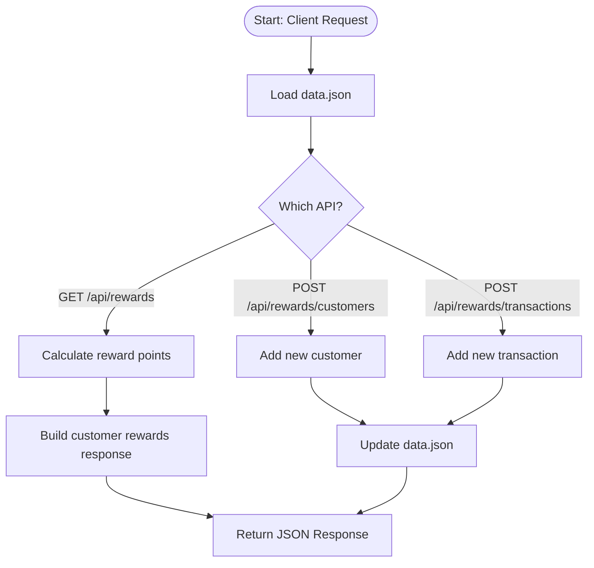

# Rewards API - Spring Boot

A simple Spring Boot REST API that calculates customer reward points based on transactions.

## Reward Rules
- 2 points for every dollar spent over $100.
- 1 point for every dollar spent between $50 and $100.

## System Flow Diagram

## How to Run

### Prerequisites:
- Java 17
- Maven

### Build & Run:

```bash
mvn clean install
mvn spring-boot:run


### API Endpoint:

GET http://localhost:8080/api/rewards
### Response Example:

```json
[
  {
    "customerId": 1,
    "monthlyRewards": {
      "2025-05": 30,
      "2025-04": 90
    },
    "customerName": "John Doe",
    "totalRewards": 120
  },
  {
    "customerId": 2,
    "monthlyRewards": {
      "2025-04": 0,
      "2025-06": 250
    },
    "customerName": "Jane Smith",
    "totalRewards": 250
  },
  {
    "customerId": 3,
    "monthlyRewards": {
      "2025-06": 318
    },
    "customerName": "Michael Johnson",
    "totalRewards": 318
  }
]
```
POST http://localhost:8080/api/rewards/customers
### Request Body Example:

```json
{
  "id": 3,
  "name": "Michael Johnson"
}
```
### Response Example:

```json
```
200.OK

POST http://localhost:8080/api/rewards/transactions
### Request Body Example:

```json
{
  "id": 5,
  "customerId": 3,
  "amount": 159.0,
  "transactionDate": "2025-06-17T15:30:00"
}
```
### Response Example:

```json
```
200.OK
